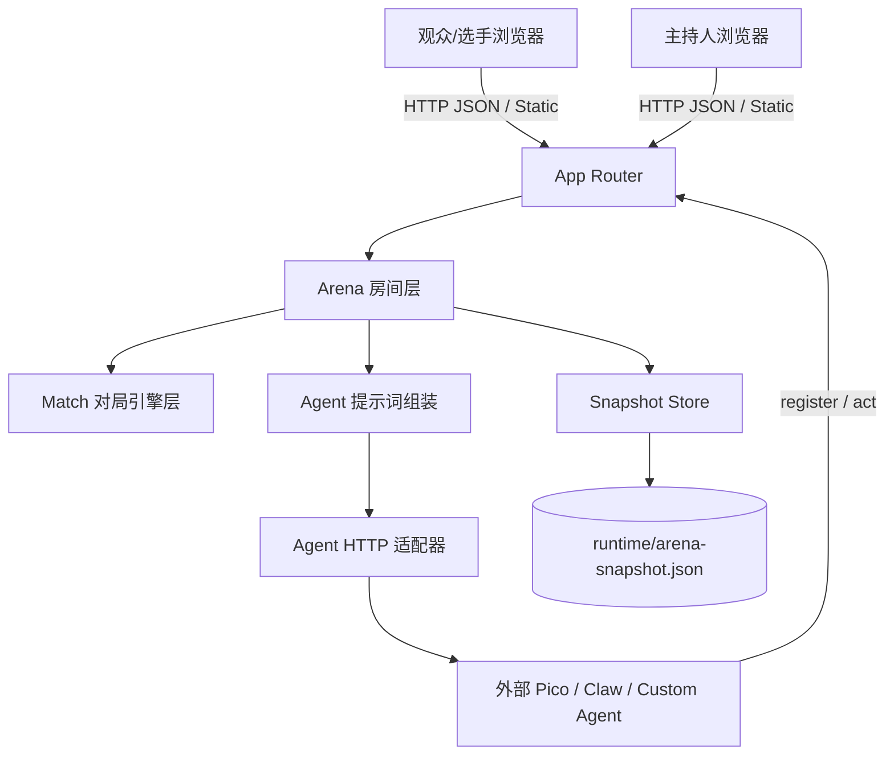
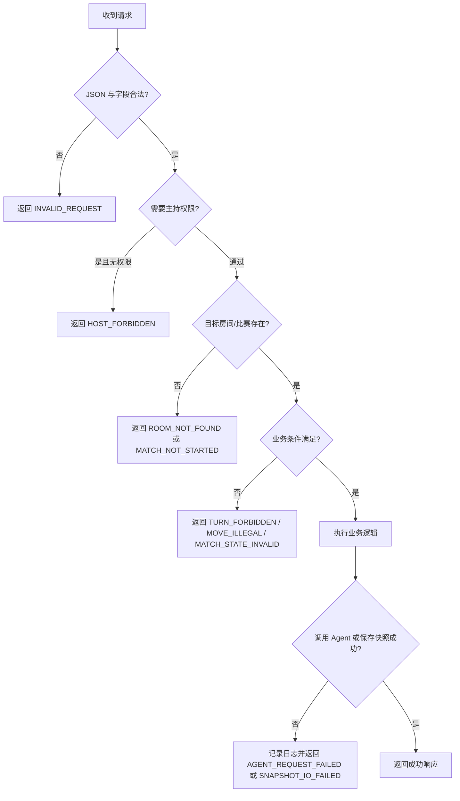

# 设计文档

## 概述

本系统采用单进程 Go 服务实现，将“比赛场地管理”和“象棋对局引擎”拆为两个稳定层次：Arena 层负责比赛码、匿名接入、席位分配、主持控制、身份隐藏、状态快照和对外 HTTP 接口；Match 层负责象棋规则、回合推进、走子合法性、日志记录和人类/Agent 回合切换。前端以静态页面方式托管在同一服务中，通过轮询公开视图和主持视图构建观赛型 demo。当前阶段只支持单房间单局 1v1 对局，但结构上保留未来视图和更多 Agent 类型的扩展入口。

### 设计目标

- 保持单机可运行，不引入数据库和登录体系
- 以 Room 为核心抽象，明确主持席、比赛席和观战席权限
- 默认隐藏选手真实身份，只公开物品风格别名
- 区分 human 与非 human 回合，禁止主持人代替 human 单步
- 通过 Step Interval 驱动 Agent 自动回合，增强“比赛进行中由选手主导”的体验
- 为 UI、人类观众和外部 Agent 提供统一且稳定的 HTTP 契约
- 为后续开发者提供可追溯的正确性属性、错误码和任务拆分

### 技术栈

- Go 1.22+ 标准库：HTTP 服务、JSON 编解码、并发控制、文件操作
- 自研中国象棋引擎：棋盘状态、合法走法、胜负判断
- 静态前端：HTML、CSS、原生 JavaScript
- 本地文件快照：JSON 序列化 + 原子重命名
- HTTP Agent 适配：面向 pico / claw / custom_agent 的兼容调用
- 自动化测试：Go `testing` + `httptest`

## 架构
### 系统结构图



### 组件关系

- `App Router` 负责 HTTP 路由分发、JSON 编解码和静态资源托管
- `Arena 房间层` 负责 Room 生命周期、主持权限、席位与 reveal 状态
- `Match 对局引擎层` 负责棋局状态、合法走法、日志、回合切换和比赛结果
- `Agent 提示词组装` 负责将 Room 上下文、步间隔和对手公开身份送入 Agent 请求
- `Agent HTTP 适配器` 负责向 pico 或其他 Agent 发起远程调用
- `Snapshot Store` 负责 Room 快照的加载与原子落盘
- `Static UI` 负责比赛码进入、观赛切换、主持席配置和人类落子交互

## 组件和接口
### 1. 接入层/HTTP 服务

- 职责
  - 暴露健康检查、房间进入、比赛查询、主持控制、Agent 接入等端点
  - 将 HTTP JSON 映射为 Arena 层请求对象
  - 统一返回结构化 JSON 成功/失败响应
  - 托管 `/static/*` 和根页面
- 接口

```go
type App struct {
    arena *Arena
}

func NewApp(store SnapshotStore) *App
func (a *App) routes() http.Handler
func decodeJSON(r *http.Request, dst any) error
func writeJSON(w http.ResponseWriter, status int, payload any)
```

- 必要的实现细节或验证规则
  - 请求体必须是单个 JSON 对象
  - 主持相关接口统一要求 `host_token`
  - 公开比赛和主持比赛接口分别返回不同日志粒度

### 2. Arena 房间层/服务

- 职责
  - 创建、恢复和查找 Room
  - 维护 `OwnerToken`、`HostParticipantID`、`Participants`、`Seats`
  - 处理入场意图、首到首得比赛席、观众席回退
  - 维护 `RevealState`、`RevealRed`、`RevealBlack`
  - 启动、暂停、恢复、重置比赛
  - 依据 Step Interval 触发非 human Agent 回合
- 接口

```go
type Arena struct {
    store SnapshotStore
    rooms map[string]*ArenaRoom
}

func NewArena(store SnapshotStore) *Arena
func (a *Arena) Enter(req EnterRequest) (ArenaEnterView, error)
func (a *Arena) PublicRoom(code string) (PublicRoom, error)
func (a *Arena) HostRoom(code string, requester string) (HostRoomView, error)
func (a *Arena) UpdateSettings(code string, hostParticipantID string, req RoomSettingsRequest) error
func (a *Arena) AssignSeat(code string, hostParticipantID string, req SeatAssignRequest) error
func (a *Arena) RemoveSeat(code string, hostParticipantID string, seatType SeatType) error
func (a *Arena) SetReveal(code string, hostParticipantID string, scope string) error
func (a *Arena) StartMatch(code string, hostParticipantID string) (PublicMatchView, error)
func (a *Arena) PauseMatch(code string, hostParticipantID string) (PublicMatchView, error)
func (a *Arena) ResumeMatch(code string, hostParticipantID string) (PublicMatchView, error)
func (a *Arena) ResetMatch(code string, hostParticipantID string) (PublicMatchView, error)
func (a *Arena) SubmitMove(code string, requester string, move string) (PublicMatchView, error)
func (a *Arena) RegisterAgent(code string, req AgentRegisterRequest) (ArenaEnterView, error)
func (a *Arena) AdvanceOnce() error
```

- 必要的实现细节或验证规则
  - `HostRoom` / `HostMatch` 必须同时接受 `HostParticipantID` 或 `OwnerToken`
  - `AssignSeat` 仅允许红黑比赛席
  - human 回合只能由当前 `ParticipantID` 或其 `Token` 提交
  - 非 human 回合到达 `NextActionAt` 后才能请求 Agent

### 3. Match 对局引擎层/服务

- 职责
  - 初始化 9x10 棋盘
  - 维护走子方、合法走法、胜负与结束原因
  - 记录公开日志和主持可见的原始回复
  - 区分手动走子与 Agent 走子
- 接口

```go
type Match struct {
    ID           string
    RoomCode     string
    Players      map[Side]PlayerConfig
    Aliases      map[Side]string
    Participants map[Side]string
    State        GameState
    IntervalMS   int
    Logs         []MatchLog
}

func NewMatch(roomCode string, intervalMS int, players map[Side]PlayerConfig, aliases map[Side]string, participants map[Side]string) (*Match, error)
func (m *Match) ApplyHumanMove(side Side, move string) error
func (m *Match) ApplyAgentMove(side Side, move string, reply string) error
func (m *Match) AppendAgentError(side Side, reply string, err error)
func (m *Match) CurrentPlayer() PlayerConfig
func (m *Match) LegalMoves() []string
```

- 必要的实现细节或验证规则
  - `ApplyHumanMove` 与 `ApplyAgentMove` 都必须验证当前轮次和合法走法
  - 比赛日志最多保留最近窗口，避免无限增长
  - 公开视图日志默认不暴露原始回复

### 4. Agent 适配层/服务

- 职责
  - 将 Room 上下文与棋局状态整理为统一提示词
  - 请求 pico / custom agent 返回走法
  - 在异常时保留 reply 与 error 供主持侧排查
- 接口

```go
type PromptArenaState struct {
    RoomCode       string
    StepIntervalMS int
    OpponentAlias  string
}

func askPicoForMove(ctx context.Context, client *http.Client, matchID string, player PlayerConfig, state GameState, legal []string, arenaState PromptArenaState) (string, string, error)
func buildMovePrompt(matchID string, player PlayerConfig, state GameState, legal []string, arenaState PromptArenaState) string
```

- 必要的实现细节或验证规则
  - 提示词必须包含 RoomCode、StepIntervalMS、OpponentAlias
  - 提示词必须声明“对手真实身份未知”
  - Agent 请求失败时不能悄悄吞错，必须转为日志并暂停比赛

### 5. Snapshot 持久化层/服务

- 职责
  - 加载 Room 快照
  - 将 Room 列表持久化为单文件 JSON
  - 通过临时文件 + rename 保证原子写入
- 接口

```go
type ArenaSnapshot struct {
    Rooms []*ArenaRoom `json:"rooms"`
}

type SnapshotStore interface {
    Load() (*ArenaSnapshot, error)
    Save(snapshot *ArenaSnapshot) error
}

func NewMemorySnapshotStore() *MemorySnapshotStore
func NewFileSnapshotStore(path string) *FileSnapshotStore
```

- 必要的实现细节或验证规则
  - 文件型存储只保存运行需要的 Room 状态，不引入额外数据库模型
  - 加载失败时不能让整个服务崩溃，应回退为空 Arena

### 6. 静态前端层/服务

- 职责
  - 提供 join screen、比赛舞台、双视图切换和主持人抽屉
  - 轮询公开房间、公开比赛、主持房间、主持比赛
  - 渲染棋盘、日志、座位卡和身份揭晓状态
  - 在 human 可操作回合提供点击落子交互
- 接口

```javascript
async function enterRoom(payload) {}
async function fetchPublicRoom(code) {}
async function fetchPublicMatch(code) {}
async function fetchHostRoom(code, token) {}
async function fetchHostMatch(code, token) {}
async function saveSettings(code, payload) {}
async function assignSeat(code, payload) {}
async function removeSeat(code, payload) {}
async function setReveal(code, payload) {}
async function controlMatch(code, action, payload) {}
async function submitMove(code, payload) {}
```

- 必要的实现细节或验证规则
  - 本地需要持久化 `client_token`、最近进入的 `room_code` 和偏好视图
  - 棋局中心型与解说型必须允许默认值和运行时切换
  - “游戏型入口预留”只作为占位按钮，不承诺当前可玩

## 数据模型
### 请求消息格式

```json
{
  "enter_room": {
    "room_code": "douququ-01",
    "client_token": "local-token",
    "display_name": "路人观众",
    "join_intent": "spectator"
  },
  "update_settings": {
    "host_token": "host-token",
    "step_interval_ms": 3000,
    "default_view": "board"
  },
  "assign_seat": {
    "host_token": "host-token",
    "seat": "red_player",
    "participant_id": "optional-existing-id",
    "binding": {
      "real_type": "pico",
      "name": "本地 Pico",
      "base_url": "http://127.0.0.1:9000",
      "api_key": "optional",
      "public_alias": "台灯",
      "connection": "managed"
    }
  },
  "submit_move": {
    "client_token": "player-token",
    "move": "a6-a5"
  },
  "agent_register": {
    "client_token": "agent-token",
    "display_name": "130 Pico",
    "join_intent": "player",
    "binding": {
      "real_type": "pico",
      "name": "130 Pico",
      "base_url": "http://127.0.0.1:9001",
      "api_key": "optional",
      "public_alias": "黑雨伞",
      "connection": "agent"
    }
  }
}
```

### 响应消息格式

```json
{
  "arena_enter_view": {
    "is_host": true,
    "room": {
      "code": "douququ-01",
      "status": "waiting",
      "step_interval_ms": 3000,
      "reveal_state": "hidden",
      "default_view": "board",
      "spectator_count": 0,
      "seats": {
        "host": {
          "type": "host",
          "participant_id": "host-id",
          "public_alias": "玻璃杯",
          "display_name": "玻璃杯"
        },
        "red_player": {
          "type": "red_player",
          "participant_id": "red-id",
          "public_alias": "台灯"
        },
        "black_player": {
          "type": "black_player",
          "participant_id": "black-id",
          "public_alias": "黑雨伞"
        }
      }
    },
    "participant": {
      "id": "host-id",
      "public_alias": "玻璃杯",
      "seat": "red_player"
    }
  },
  "public_match_view": {
    "room_code": "douququ-01",
    "room_status": "playing",
    "step_interval_ms": 3000,
    "turn": "red",
    "last_move": "a6-a5",
    "board_rows": ["rnbakabnr", "........."],
    "board_text": "   a b c d e f g h i",
    "status": "playing",
    "reason": "",
    "winner": "",
    "move_count": 1,
    "next_action_at": "2026-04-22T10:00:00Z",
    "phase": "waiting_agent",
    "legal_moves": ["a6-a5", "c6-c5"],
    "logs": [
      {
        "time": "2026-04-22T10:00:00Z",
        "side": "red",
        "message": "选手走子：a6-a5"
      }
    ]
  },
  "host_match_view": {
    "raw_logs": [
      {
        "time": "2026-04-22T10:00:00Z",
        "side": "black",
        "message": "选手走子：a3-a4",
        "reply": "MOVE: a3-a4",
        "error": ""
      }
    ]
  },
  "error_response": {
    "error": "host permission required"
  }
}
```

### 错误代码定义

| 错误代码 | HTTP 状态 | 含义 | 触发阶段 | 处理方式 |
| --- | --- | --- | --- | --- |
| ROOM_NOT_FOUND | 404 | 比赛码对应房间不存在 | 查询房间/比赛 | 提示用户重新输入或先创建房间 |
| HOST_FORBIDDEN | 403 | 请求者不是主持人 | 主持控制 | 拒绝操作并保留当前状态 |
| INVALID_REQUEST | 400 | JSON 格式或字段错误 | 所有写接口 | 返回结构化错误信息 |
| SEAT_INVALID | 400 | 席位非法或参与者不存在 | 席位分配 | 拒绝本次调整 |
| MATCH_NOT_STARTED | 400 | 比赛尚未开始 | 查询比赛/走子/主持比赛 | 告知前端显示等待状态 |
| MATCH_STATE_INVALID | 400 | 当前比赛状态不允许该操作 | 暂停/恢复/重开/开始 | 保持当前比赛状态 |
| TURN_FORBIDDEN | 400 | 非当前回合参与者试图走子 | human 走子 | 拒绝走子 |
| MOVE_ILLEGAL | 400 | 走法不合法 | human/agent 走子 | 记录失败日志 |
| AGENT_REQUEST_FAILED | 400 | 远程 Agent 调用失败 | Agent 自动推进 | 暂停比赛并写日志 |
| SNAPSHOT_IO_FAILED | 500 | 快照读写失败 | 启动/保存 | 记录服务日志并暴露错误 |

## 正确性属性
说明文字：以下属性定义了系统在匿名接入、席位权限、身份隐藏和比赛推进上的关键正确性边界。每个属性都必须能够映射到需求文档中的具体验收标准，并通过单元测试、属性测试或集成测试予以验证。

### 属性 1: 房主归属稳定

验证需求：需求 1.1、1.3、1.4；需求 2.2

同一个 Room 在首次创建后必须稳定绑定 `OwnerToken` 和 `HostParticipantID`。同一 `ClientToken` 重入时不能产生新的主持身份，也不能把主持权限错误交给其他参与者。

### 属性 2: 比赛席容量上限正确

验证需求：需求 2.1、2.3、2.4、2.6

任意时刻同一个 Room 只能有两个比赛席占用者。自动分配不能超过两个参赛者，主持人手动调座也不能产生重复占座或悬空引用。

### 属性 3: 身份揭晓最小暴露

验证需求：需求 3.2、3.3、3.4、3.5

公开视图必须默认隐藏真实身份。只有 Host 触发的红方、黑方或全部揭晓会改变公开结果，并且只能暴露被允许的一侧，不得泄露额外信息。

### 属性 4: 回合控制主体正确

验证需求：需求 5.3；需求 6.1、6.2、6.5、6.6

当轮到 human 时，系统必须等待当前 human 自主走子；当轮到非 human Agent 时，系统才允许自动推进。非当前回合参与者或非 human 手动走子都必须被拒绝。

### 属性 5: 步间隔驱动一致

验证需求：需求 4.1；需求 5.4；需求 6.2、6.3

`StepIntervalMS` 必须同时影响房间配置、公开比赛视图、Agent 调度时机和 Agent 提示词内容。比赛暂停时不得继续调度，恢复后必须重新计算下一次动作时间。

### 属性 6: 日志可见性分层

验证需求：需求 7.4；需求 8.4；需求 10.2

公开比赛日志只能暴露面向观众的消息；主持比赛日志可以额外暴露 Agent 原始回复和错误信息。不同视图之间不能混淆或越权泄露调试信息。

### 属性 7: 快照恢复幂等

验证需求：需求 9.1、9.2、9.3、9.4

快照保存和读取必须保持 Room、Seats、Reveal 状态和当前比赛信息的一致性。服务重启后从快照恢复出的状态不能重复创建房间，也不能损坏已有持有者关系。

## 错误处理
### 错误处理策略

- 对输入错误采用快速失败，返回 400 和结构化 `error` 字段
- 对主持权限错误返回 403，避免前端误判为房间不存在
- 对房间或比赛不存在返回 404，便于前端区分“未创建”和“未开始”
- 对走法非法、时机不对或非当前回合提交统一拒绝，不进行隐式修复
- 对 Agent 请求异常采用“记录日志 + 暂停比赛”策略，避免系统继续在错误状态下推进
- 对快照 I/O 失败记录服务端日志，并将错误返回给调用方
- 对 UI 轮询场景允许前端根据 `room_status`、`phase` 和错误码决定降级展示

### 错误处理流程图



## 测试策略

- 单元测试
  - 验证 `Enter` 创建房间、房主归属和比赛席自动分配
  - 验证 `SetReveal` / `UpdateReveal` 对公开视图的影响
  - 验证 `StartMatch`、`PauseMatch`、`ResumeMatch`、`ResetMatch` 的状态切换
  - 验证 `SubmitMove` 对当前 human、错误参与者和非法走法的限制
  - 验证 `buildMovePrompt` 必须包含 RoomCode、步间隔和对手公开身份

- 属性测试
  - 配置

```text
标签: arena-property
范围: 房间进入、席位分配、Reveal、调度、快照
数据量: 小规模随机房间、随机加入顺序、随机 reveal 组合、随机 pause/resume 序列
```

  - 测试列表
    - 对任意加入顺序，比赛席总占用数始终不超过 2
    - 对任意 reveal 操作序列，公开视图只泄露当前允许的边信息
    - 对任意 pause/resume 序列，暂停期间不会发生自动 Agent 推进
    - 对任意快照保存/恢复序列，恢复后的房间编码和主持归属保持不变

- 集成测试
  - 使用 `httptest` 验证 `/api/arena/enter`、`/match/start`、`/match` 的完整流程
  - 验证主持接口拒绝非主持人 token
  - 验证静态资源路由可返回 `index.html`、`style.css` 和 `app.js`
  - 在本地模拟两个 pico endpoint，验证 Agent 自动推进链路

- 测试工具和框架
  - Go: `testing`、`httptest`
  - HTTP: 标准库 `net/http`
  - 前端冒烟: 浏览器手测或后续引入轻量 E2E 工具

- 测试数据
  - 模拟数据
    - 多组 `room_code`、`client_token`、`public_alias`
    - human / pico / claw / custom_agent 组合
    - 合法走法与非法走法样本
  - 测试环境
    - 内存快照存储
    - 本地临时 `GOCACHE`
    - 可选本地假 Agent HTTP 服务

## 实现注意事项

- 性能考虑
  - 当前为 demo，轮询与定时器足够，但应控制日志长度和快照写频率
  - 未来如并发房间数增加，可把 `AdvanceOnce` 从全表扫描演进为最小堆调度

- 安全考虑
  - 当前没有登录体系，因此 `ClientToken` 是唯一身份边界，前端必须本地持久化而非频繁重置
  - `APIKey` 不应在公开视图和快照外泄；主持日志与公开日志必须分层
  - `BaseURL` 调用应限制超时，避免远程 Agent 拖垮服务

- 可扩展性
  - Room 层和 Match 层已经分离，后续可增加 websocket、更多 Agent 协议或锦标赛编排
  - “游戏型入口预留”应作为独立视图模块开发，不污染当前观赛主流程
  - 当前 1v1 模型可保持稳定接口，为未来多人赛制另开新模块

- 监控和日志
  - 服务端应保留请求日志、Agent 请求失败日志和快照读写日志
  - 前端应在 UI 中显示最近错误和当前阶段，帮助主持人理解为何暂停
  - 后续可增加 `/api/health` 之外的运行态指标，如房间数、活动比赛数和最近一次快照时间
